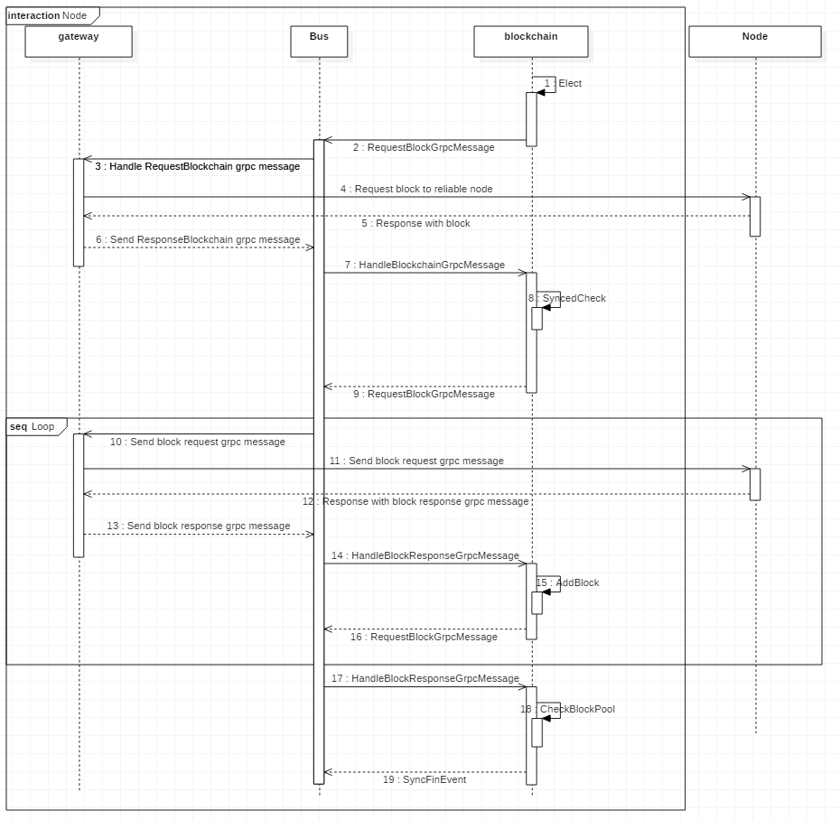
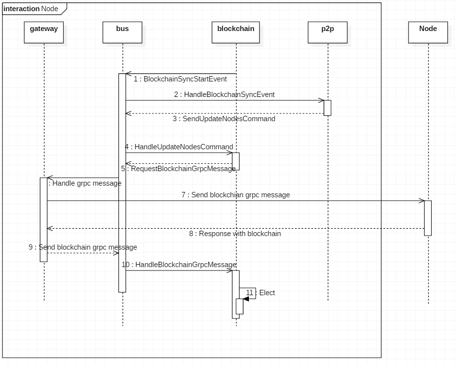

# 블록체인 

- 블록체인(BlockChain)

  블록체인은 [해쉬](https://en.wikipedia.org/wiki/Cryptographic_hash_function)로 연결된 지속적으로 늘어나는 블록들의 리스트다.그 해쉬는 이전 블록의 링크역할을 한다.

- 블록(Block)

  블록은 블록 헤더와 블록 데이터로 이루어져있다. 그리고 Ledger의 블록체인 구조를 위하여 다음 블록은 블록 헤더를 해싱한 값을 가지고 있다. 블록헤더는 이전 블록의 해쉬 값과 머클 트리 루트의 해쉬 값을 가지고 있다. 블록데이터는 트랜잭션 리스트를 가지며 트랜잭션의 위변조를 효율적으로 관리하기 위해 머클트리를 가지고 있다.

- 트랜잭션(Transaction)

  스마트 컨트랙트를 수행하기 위한 작은 장치이다. 트랜잭션은 실제로 트랜잭션을 실행시키는 피어(노드)의 아이디, 트랜잭션 해쉬 값, 계약 내용을 담고 있는 트랜잭션 데이터를 가지고있다.

- 머클 트리(Merkle Tree)

  머클 트리는 이진 트리이고 각 리프노드들은 블록 안의 트랜잭션의 해쉬값을 가진다. 루트 노드는 전체 트랜잭션을 나타내는 해쉬 값을 가진다. 여기서 전체 트랜잭션을 나타내는 해쉬값은 리프 노드부터 각각 자식 노드들의 해쉬 값들을 해쉬한 값을 말한다. 머클 트리는 O(1)시간만에 트랜잭션 정보들이 바뀌었는지 머클 트리의 루트 해쉬값을 통해서 확인할 수 있다. 더불어, 머클 트리는 원장 안에 있는 트랜잭션들의 유효성을 효율적으로 검증할 수 있다. 왜냐하면 블록 헤더는 머클 트리의 루트 노드의 해쉬 값을 가지고 있고 다음 블록은 현재 블록의 해쉬 값을 블록 헤더에 가지고 있기 때문이다. 그리고 머클 트리는 머클 경로(트랜잭션의 루트 노드까지의 자식 노드)를 구할 수 있기 때문에 특정 트랜잭션의 유효성을 O(lgN)시간 만에 구할 수 있다는 장점이 있다.

  

## Database 
블록체인은 구성에 따라 여러 유형의 데이터베이스에 저장된다. 현재는 levelhelper와 filehelper의 기능이 추가되어져 있다. 기본 DB는 levelDB이다. 블록의 해시값이나 블록의 번호, 트랜잭션 ID를 가지고 블록을 검색할 수 있다. 또한 트랜잭션ID를 가지고 해당하는 트랜잭션을 검색 가능하다. 만약 다른 데이터베이스를 사용하길 원한다면 blockchainleveldb에서 구현하고 blockchain_db_interface를 수정하세요.

### Related config
데이터베이스의 설정은 config.yaml에 정의된다.

- Type

  데이터베이스의 유형. 현재는 levelDB와 파일에 대한 몇몇의 helper기능이 지원된다.

- Leveldb

  leveldb의 구성
  
  | 키           | 설명                                            |
  | ------------ | --------------------------------------------    |
  | default_path | leveldb의 경로를 설정하지 않는다면 이 경로로 설정  |
  
### LevelDB

블록들은 키-값 스토리지인 leveldb에 저장된다.

- Blocks  

  블록들은 JSON의 형태로 직렬화되어지고 leveldb에 저장된다. 키값으로 블록의 해쉬 값과 번호가 사용된다.
  마지막 블록와 확정되지 않은 블록도 복구를 위해서 저장된다.
  
- Transactions

  모든 트랜잭션들은 직렬화되어지고 leveldb에 저장됩니다. 기본적으로 모든 트랜잭션들은 블록와 함께 저장된다.
  인덱싱을 위해서, 트랜잭션이 속한 블록의 해쉬 값도 저장된다. 트랜잭션ID는 키로 이용된다.
  
| DB 이름            | 키             | 값                           | 설명                                     |
| ----------------- | -------------- | ---------------------------- | ---------------------------------------- |
| block_hash        | BlockHash      | Serialized Block             | 블록해시를 이용하여 블록 저장              |
| block_number      | BlockNumber    | Block Hash                   | 블록 번호를 이용하여 블록 저장             |
| transaction       | Transaction ID | Serialized Transaction       | 트랜잭션 저장                             |
| unconfirmed_block | BlockHash      | Serialized unconfirmed block | 확정되지 않은 블록 저장                    |
| util              | Predefined Key | Depends on Key               | 여러 용도를 위한 DB                        |

- util DB

  Util DB는 편의를 위해서 여러 항목을 저장한다.
  
  1) Key : last_block, Value : Serialized last block
  2) Key : unconfirmed_block, Value : Serialized unconfirmed block
  3) Key : transaction ID, Value : Blockhash of block that transaction is stored

- Snapshot

  leveldb에 저장된 world state db를 복사하기 위해서 LevelDB snapshot이 추가된다.
  
### File
블록의 메타데이터는 leveldb 또는 다른 키-값 데이터베이스에 저장된다. 블록의 바디부분은 파일에 저장된다.

- Blocks

  블록의 메타데이터는 JSON에 직렬화되어 leveldb에 저장된다. 블록바디에 삽입되는 데이터는 파일에 기록된다.
  
- Transactions

  트랜잭션 데이터는 file에 저장된다. 검색을 위해서 트랜잭션 ID를 키로 사용하는 키-값 데이터베이스에 파일의 정보를 저장한다.

### Author

[@emperorhan](https://github.com/emperorhan)
[@zeroFruit](https://github.com/zeroFruit)

## 블록체인 동기화

동기화(Synchronize)는 확인(Check), 구축(Construct), 재구축(PostConstruct)의 과정을 거친다.

먼저 확인(Check)은 (1) '신뢰할 수 있는 노드'(Reliable Node) 선정과 (2) '상태 점검'을 거친다. [Reliable Node](#realible-node)를 선정하기 위해서 p2p 컴포넌트에서 peer들의 정보를 받아온다. 이들 중 blockchain height가 가장 긴 peer가 Reliable Node가 된다. Reliable Node가 정해지면 자신의 마지막 block의 height와 lastSeal을 비교해서 같은지를 확인한다. 같다면 동기화(Synchronize)는 중단되고 그렇지 않다면 구축(Construct) 단계로 넘어간다.

구축(Construct)단계에서는 Reliable Node를 대상으로 RequestBlock을 통해 block을 요청하고 BlockResponseProtocol로 응답받은 block을 받게된다. AddBlock에서는 추가할 블록이 다음 블록이 맞는지 확인하고 blockchain에 추가하게된다. 그리고 위 과정은 구축 단계 시작할 때의 Reliable Node의 blockchain을 모두 가져올 때 까지 진행된다. 즉 구축 단계 시작 이후로 Reliable Node가 쌓은 block들은 추가하지 않는다. 이런 구축 단계 이후 합의를 통해 확정된 block들은 BlockPool에 보관하게된다. 블록을 요청하고, 응답 받고,  blockchain에 추가하는 과정은 동기적으로 진행된다.(block을 요청하고, blockchain에 추가하는 두 가지 프로세스를 Producer-Consumer 패턴으로 구현하는 것도 하나의 방법이 될 수 있다.)

블록 요청(RequestBlock)은 특정 노드가 가진 마지막 block의 height를 이용해, Reliable Node에 block을 요청하게된다. 특정 노드가 새로 참여하는 노드일 경우 신뢰할 수 있는 노드의 블록 체인 내 최초 블록부터 마지막 블록까지 요청하고, 기존에 참여중이던 노드일 경우 보유 중인 블록 체인 내 마지막 블록의 다음 블록부터 신뢰할 수 있는 노드의 블록 체인 내 마지막 블록까지 요청한다.

구축(Construct)단계가 완료되고 나면, BlockPool에 block이 있는지 확인한다. block이 있다면 재구축(PostConstruct)을 수행한다. 재구축(PostConstruct)은 이미 구축(Construct)된 블록 체인에 블록 임시 저장소(BlockFool)에 보관중인 블록들을 부수적으로 추가(BlockAddedEvent)하는 것을 의미한다. 재구축(PostConstrcut)을 수행하고 나면, 동기화(Synchronize) 과정이 모두 완료된다.

### 언제 동기화를 진행해야하는가?

* Node가 처음 네트워크에 들어왔을 때
* Node가 네트워크 연결이 끊겼다 다시 연결 되었을 때(timeout 적용) 
* PostConstruct 단계에서, BlockPool의 block을 확인했는데 BlockPool의 block height가 Construct 단계에서 받은 마지막 block height에서 1보다 클 때

### 예외 사항 처리

* 동기화 중일 때는 합의에 참여하지 못하지만, 리더로부터 합의 된 블록은 받을 수 있다. 받은 블록은 BlockPool에 저장되고, 구축(Construct)단계가 끝나면 추가하게 된다.
  1. **BlockPool에 있는 block height가 Construct 단계에서 마지막으로 받은 block height보다 1만큼 크다면** prev hash값을 확인하고 valid하다면 blockchain에 추가한다.
  2. **BlockPool에 있는 block height가 Construct 단계에서 마지막으로 받은 block height에서 1보다 크다면** Reliable Node보다 긴 blockchain을 가지고 있는 노드가 있다는 뜻이므로 Reliable Node를 다시 선정해서 synchronize 과정을 반복한다. 이때 다시 선정한 Reliable Node로부터 height가 BlockPool에 있는 block height보다 1 작은 block까지 받아온다. 받아오는 과정이 끝나면 1번의 과정을 반복한다.
* 구축(Construct) 과정은 긴 시간이 걸릴 수 있기 때문에 구축과정 중간에 네트워크 연결이 끊겨버리는 문제를 생각해야 한다.: (1) 자기 자신과 네트워크 사이에서 연결이 끊긴 경우와 (2) Reliable Node가 네트워크와 연결이 끊긴 경우가 있을 수 있다.
  1. **자기 자신과 네트워크 사이에서 연결이 끊긴 경우,** 다시 연결이 되었을 때, 동기화 과정을 다시 시작하면 된다. 예를 들어 생각해보면, Reliable Node로부터 101번 block부터 10000번 block을 하나씩 받고 있는 도중 500번 block을 받고 연결이 끊겨버렸다. 그러면 다시 연결이 되었을 때, Reliable Node를 다시 선정해서 501번째 block부터 다시 받기 시작하면 된다.
  2. **Reliable Node가 네트워크와 연결이 끊긴 경우,** 마찬가지로 동기화 과정을 처음부터 시작하면 된다. 다시 Reliable Node를 선정하고 나의 마지막 block의 다음 block부터 요청한다.

### Reliable Node

blockchain 컴포넌트는 동기화를 할 때 blockchain의 길이가 가장 긴 Node를 Reliable Node로 선정하여, 그 Node를 대상으로 Construct 단계를 진행하게 된다.

Node의 정보는 p2p의 peer-table에서 받아온다. peer-table에서 받아온 Node 정보로 각 Node에게 blockchain 정보를 얻어와서 height가 가장 긴 Nodes 중 한 명을 Reliable Node를 선정한다.

### Author

[@zeroFruit](https://github.com/zeroFruit)
[@junk-sound](https://github.com/junk-sound)
