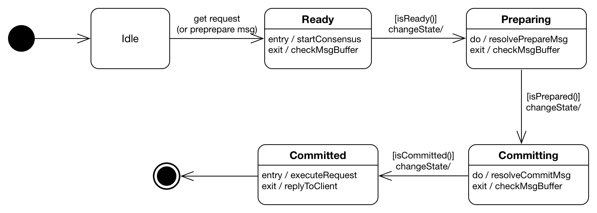
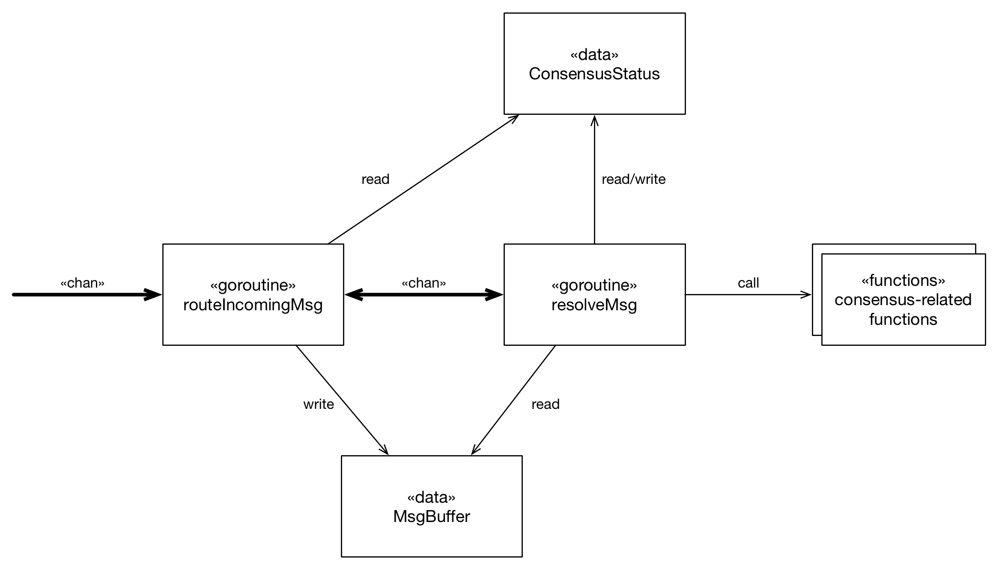
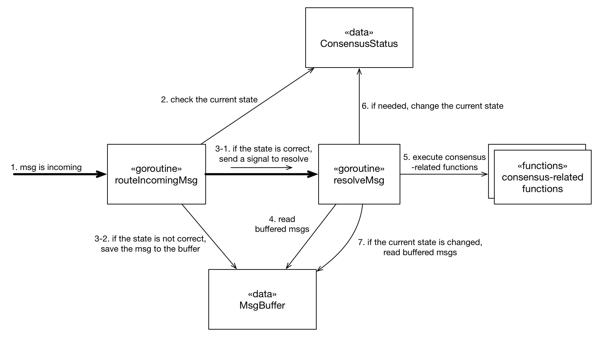

## Consensus 

### Proposed architecture for the PBFT consensus

The consensus process starts when the request message (if the node is the primary) or the pre-prepare message arrives. Then, the state is changed to `Ready` and the node starts the consensus (e.g. create required structs and goroutines.). When it is done, the node checks the message buffer if there is any message arrived earlier and proceeds to the `Preparing` state. In the `Preparing` state, the node resolves prepare messages until `isPrepared` is true. If then, same as in the previous state, the node checks the message buffer and proceeds to the `Committing` state. `Committing` state is same with `Preparing` state. Then, if `isCommitted` is true, the node's state is changed to `Committed`, executes the request's operation and replies the result of the operation to the client.

To do the PBFT consensus, the proposed code structure is like this diagram. The `routeIncomingMsg` goroutine is a daemon goroutine to take incoming consensus-related messages and route them to the appropriate location in the buffer. The `resolveMsg` goroutine reads messages from the buffer and call the appropriate consensus-related functions. If needed, this goroutine changes the state of the consensus like `Preparing` or `Committing`.

Overall behaviors are like the above diagram. When the `routeIncomingMsg` goroutine takes an incoming message, it first checks the state of the consensus. If the state is not correct, it saves the message to the buffer. If the state is correct, it send a signal to resolve the buffered messages to the `resolveMsg` goroutine. Then, the `resolveMsg` goroutine reads buffered messages and calls consensus-related functions. If needed, this goroutine change the current state. If the current state is changed, the `resolveMsg` goroutine checks buffered messages for the new state immediately without waiting the resolving signal.

This propose can be different with the detail implementation.

### Author

[@Junbeomlee](https://github.com/junbeomlee)

[@Hwi Ahn](https://github.com/byron1st)
