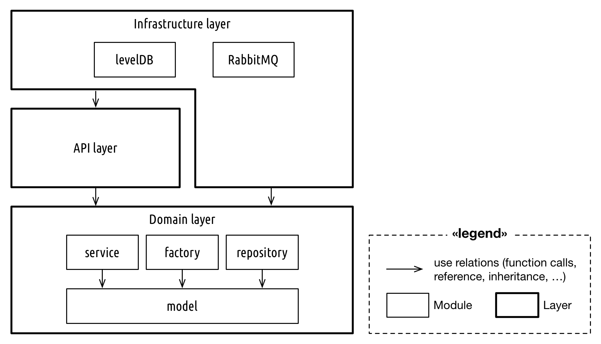

# Logical Architecture

`it-chain`의 개념 수준 아키텍처 모델은 위 그림과 같다. `it-chain` 노드는 2개의 게이트웨이 컴포넌트(`Client API Gateway` 와 `Inter-Node API Gateway`)를 통해 외부 네트워크 노드(다른 `it-chain` 노드 또는 클라이언트 어플리케이션들)와 연결된다.

* `Client Gateway`: 클라이언트 어플리케이션(서버, 모바일 앱, 데스크톱 앱 등)들을 위한 API로 REST로 제공될 예정이다.
* `gRPC Gateway`: `it-chain` 노드 간의 커뮤니케이션을 위한 서비스로, 블록 싱크, 합의 메세지 등과 같이 블록체인과 관련된 커뮤니케이션을 처리한다. RPC 형태로 제공될 예정이다.

또한 `it-chain`은 6개의 독립적으로 동작하는 핵심 컴포넌트들로 구현되며, 각각은 AMQP(Asynchronous Message Queue Protocol)를 통해 커뮤니케이션한다. AMQP는 이벤트 버스 커넥터이며, 게이트웨이로 들어온 외부 메세지에 맞춰 내부 핵심 컴포넌트들을 위한 이벤트를 생성하여 배포하며, 각 핵심 컴포넌트들은 자신들이 이미 등록한 이벤트를 받아서 동작한다. AMQP의 구체적인 구현체는 [RabbitMQ](https://www.rabbitmq.com)를 사용한다.

`it-chain core`의 각 컴포넌트는 동작에 필요한 데이터를 직접 갖고 있다 (Micro Service Architecture 구조에서 참조). 그렇기 때문에 경우에 따라선 데이터가 서로 다른 컴포넌트에 중복되서 저장될 수 있으며, 이를 허용한다.

* TxPool 컴포넌트: 트랜잭션을 임시로 저장하고 관리하는 컴포넌트로, 합의되어 블록에 저장되지 않은 트랜잭션들을 모아둔다.
* Consensus 컴포넌트: 합의를 담당하는 컴포넌트이며, 현재는 PBFT(Practical Byzantine Fault Tolerance) 알고리즘을 따른다.
* BlockChain 컴포넌트: 블록을 생성하고 관리하는 컴포넌트이다.
* P2P 컴포넌트: 네트워크의 참여하는 Peer들을 찾고, 유지하는 컴포넌트이다.
* Auth 컴포넌트: 각종 인증을 담당한다.
* iCode 컴포넌트: it-chain의 스마트 컨트랙트인 iCode 관련 기능을 담당한다.

# Strategic Model Design
각 Service 내의 Strategic Model Design은 다음과 같다.

위 그림과 같이 Strategic Design은 Onion Architecture 형태를 띄며, 여기서 핵심의 외곽에 있는 layer만이 안에 있는 layer를 import 할 수 있고 내부 layer는 바깥쪽 layer를 import 할 수 없다는 점이다.

하지만 Domain 과 API 의 많은 기능들은 infra가 제공하는 기능을 사용해햐 하는데 이것이 어떻게 가능할까라는 문제점이 제기된다.
이것은 바로 domain 내에서 infra 내의 기능들에 대한 interface를 구현에 둠으로써 해결되고, 이를 통해 infra를 완벽하게 숨기고 로직을 처리할 수 있게 된다.

## API
API 레이어는 다른 bounded context와 협력을 위한 다양한 api를 제공한다.
다른 bonded context 내의 서비스들을 오직 api를 통해서만 해당 서비스에 접근이 가능하다.

## Domain
도메인 레이어는 크게 model, factory, service, repository 로 구성된다.

### model
model 은 해당 bounded context 에서 주로 사용되는 entity와 이를 구성하는 value object를 정의한다.

### factory
factory는 model의 entity를 생성해 주는 역할을 담당하며, 다양한 값을 받아 value object를 구현하고 이를 조합하여 entity를 생성해 반환해 주는 역할을 수행한다.

### Service
service는 해당 subcontext 내의 다양한 기능을 수행하며, infra의 기능들에 대한 interface를 만들어 준다.
api 와 service 내에서 infra layer에 접근하지 않기 위해서 이 service 단에서 interface를 구현해 두고 필요한 경우 사용한다.

### repository
repository는 entity 및 value object 를 기준으로 하여 db와의 입출력을 담당하며, it-chain에서는 levelDB와의 통신을 수행한다.
하지만 직접적인 통신의 구현은 infra layer 에서 수행하며, 본 repository에서는 실제적인 구현 내용은 숨기고 interface 형태로 함수만을 선언하여 기능을 추상화 시켜준다.

## Infra
infra layer 에서는 messaging 및 levelDB 통신 등 서비스에 필요한 기반환경을 구현하고 있다.
앞서 repository 에서 정의한 함수에 대한 실질적인 구현이 이루어지며, rabitMQ 서버와 통신을 구현한다.

# Module Architecture

위 모델은 `it-chain-Engine`의 개별 컴포넌트의 모듈 아키텍처를 Layered 아키텍처 패턴을 적용하여 표현한 모델이다. 모듈 아키텍처는 개념 수준 아키텍처 모델과는 달리 시스템의 코드 측면 구조를 표현한다. (개념 수준 아키텍처 모델은 시스템의 실행 측면 구조를 묘사하였다.)

모듈 아키텍처는 코드가 추상화된 집합인 모듈과 레이어로 구성되고, 화살표는 사용관계(함수 호출, 필드 레퍼런스, 상속 관계 등을 모두 의미. 코드에서는 최종적으로 `import`로 나타나는 관계이다)를 의미한다. 레이어는 모듈들의 집합체로, 모듈들 사이의 사용 관계를 위에서 아래 방향으로만 가능하도록 제한하기 위해 존재하는 개념이다. 즉, 위의 그림에서 Infrastructure Layer는 API Layer를 사용할 수 있지만(a.k.a Infrastructure Layer에 속하는 모듈은 API Layer에 속하는 모듈의 함수를 사용하거나 인터페이스를 상속받을 수 있다), API Layer는 Infrastructure Layer를 사용할 수 없다.

위 그림은 앞서 제시된 Onion Architecture에서 제시된 사용 관계의 제한과 DDD 개발방법에서 정의하는 사용 관계의 제한을 반영하여 그려졌다. 아래 추적성 관리 테이블을 참고하여, 코드 작성시 아키텍처 모델에 명시된 사용 관계를 지키도록 유의한다.

## 모듈-코드 추적성 테이블
모듈 | 코드
-----|-----
Infrastructure layer | `{component-name}/infra` package
API layer | `{component-name}/api` package
Domain layer | `{component-name}` package
