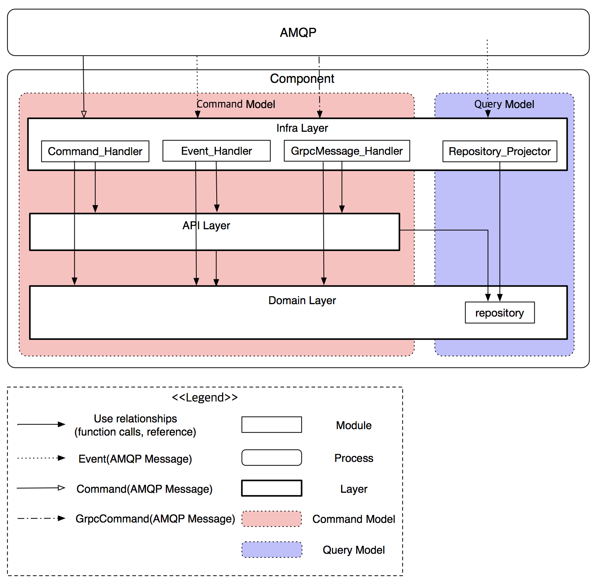

# Logical Architecture

`it-chain`의 개념 수준 아키텍처 모델은 위 그림과 같다. `it-chain` 노드는 2개의 게이트웨이 컴포넌트(`Client API Gateway` 와 `Inter-Node API Gateway`)를 통해 외부 네트워크 노드(다른 `it-chain` 노드 또는 클라이언트 어플리케이션들)와 연결된다.

* `Client Gateway`: 클라이언트 어플리케이션(서버, 모바일 앱, 데스크톱 앱 등)들을 위한 API로 REST로 제공될 예정이다.
* `gRPC Gateway`: `it-chain` 노드 간의 커뮤니케이션을 위한 서비스로, 블록 싱크, 합의 메세지 등과 같이 블록체인과 관련된 커뮤니케이션을 처리한다. RPC 형태로 제공될 예정이다.

또한 `it-chain`은 6개의 독립적으로 동작하는 핵심 컴포넌트들로 구현되며, 각각은 AMQP(Asynchronous Message Queue Protocol)를 통해 커뮤니케이션한다. AMQP는 이벤트 버스 커넥터이며, 게이트웨이로 들어온 외부 메세지에 맞춰 내부 핵심 컴포넌트들을 위한 이벤트를 생성하여 배포하며, 각 핵심 컴포넌트들은 자신들이 이미 등록한 이벤트를 받아서 동작한다. AMQP의 구체적인 구현체는 [RabbitMQ](https://www.rabbitmq.com)를 사용한다.

`it-chain core`의 각 컴포넌트는 동작에 필요한 데이터를 직접 갖고 있다 (Micro Service Architecture 구조에서 참조). 그렇기 때문에 경우에 따라선 데이터가 서로 다른 컴포넌트에 중복되서 저장될 수 있으며, 이를 허용한다.

* TxPool 컴포넌트: 트랜잭션을 임시로 저장하고 관리하는 컴포넌트로, 합의되어 블록에 저장되지 않은 트랜잭션들을 모아둔다.
* Consensus 컴포넌트: 합의를 담당하는 컴포넌트이며, 현재는 PBFT(Practical Byzantine Fault Tolerance) 알고리즘을 따른다.
* BlockChain 컴포넌트: 블록을 생성하고 관리하는 컴포넌트이다.
* P2P 컴포넌트: 네트워크의 참여하는 Peer들을 찾고, 유지하는 컴포넌트이다.
* Auth 컴포넌트: 각종 인증을 담당한다.
* iCode 컴포넌트: it-chain의 스마트 컨트랙트인 iCode 관련 기능을 담당한다.

# Module Architecture

위 모델은 `it-chain-Engine`의 개별 컴포넌트의 모듈 아키텍처를 Layered 아키텍처 패턴을 적용하여 표현한 모델이다. 모듈 아키텍처는 개념 수준 아키텍처 모델과는 달리 시스템의 코드 측면 구조를 표현한다. (개념 수준 아키텍처 모델은 시스템의 실행 측면 구조를 묘사하였다.)

모듈 아키텍처는 코드가 추상화된 집합인 모듈과 레이어로 구성되고, 화살표는 사용관계(함수 호출, 필드 레퍼런스, 상속 관계 등을 모두 의미. 코드에서는 최종적으로 `import`로 나타나는 관계이다)를 의미한다. 레이어는 모듈들의 집합체로, 모듈들 사이의 사용 관계를 위에서 아래 방향으로만 가능하도록 제한하기 위해 존재하는 개념이다. 즉, 위의 그림에서 Infrastructure Layer는 API Layer를 사용할 수 있지만(a.k.a Infrastructure Layer에 속하는 모듈은 API Layer에 속하는 모듈의 함수를 사용하거나 인터페이스를 상속받을 수 있다), API Layer는 Infrastructure Layer를 사용할 수 없다.

다음은 각 모듈에 대한 간략한 설명이다.

**API**
API 레이어는 다른 bounded context와 협력을 위한 다양한 api를 제공한다.
다른 bonded context 내의 서비스들을 오직 api를 통해서만 해당 서비스에 접근이 가능하다.

**model**
model 은 해당 bounded context 에서 주로 사용되는 entity와 이를 구성하는 value object를 정의한다.

**factory**
factory는 model의 entity를 생성해 주는 역할을 담당하며, 다양한 값을 받아 value object를 구현하고 이를 조합하여 entity를 생성해 반환해 주는 역할을 수행한다.

**Service**
service는 해당 subcontext 내의 다양한 기능을 수행하며, infra의 기능들에 대한 interface를 만들어 준다.
api 와 service 내에서 infra layer에 접근하지 않기 위해서 이 service 단에서 interface를 구현해 두고 필요한 경우 사용한다.

**repository**
repository는 entity 및 value object 를 기준으로 하여 db와의 입출력을 담당하며, it-chain에서는 levelDB와의 통신을 수행한다.
하지만 직접적인 통신의 구현은 infra layer 에서 수행하며, 본 repository에서는 실제적인 구현 내용은 숨기고 interface 형태로 함수만을 선언하여 기능을 추상화 시켜준다.

**Infra**
infra layer 에서는 messaging 및 levelDB 통신 등 서비스에 필요한 기반환경을 구현하고 있다.
앞서 repository 에서 정의한 함수에 대한 실질적인 구현이 이루어지며, rabitMQ 서버와 통신을 구현한다.

위 그림은 앞서 제시된 Onion Architecture에서 제시된 사용 관계의 제한과 DDD 개발방법에서 정의하는 사용 관계의 제한을 반영하여 그려졌다. 아래 추적성 관리 테이블을 참고하여, 코드 작성시 아키텍처 모델에 명시된 사용 관계를 지키도록 유의한다.

# Communication between components via AMQP
it-chain의 컴포넌트들 간의 통신은 AMQP(Advanced Message Que Protocol) 라이브러리인 rabbitMQ 을 활용하여 이루어 진다. it-chain 에서는 보다 일관되고 효율적인 구현을 위한 자체구축 라이브러리인 midgard를 사용하며, 각 컴포넌트는 midgard를 통해 보다 쉽게 통신 관련 기능을 구현할 수 있다. it-chain의 AMQP 메세지에는 event와 command 가 있는데, 여기서 `event` 는 해당 컴포넌트의 root aggregate에 변화가 생긴 경우, `command` 는 다른 컴포넌트의 root aggregate에 변화를 요구하는 경우 발생하며 `event` 와 `command` 모두 오직  api layer 혹은 서비스 단에서 publish 된다.

여기서 중요한 점은 `event handler` 와 `command handler` 의 역할은 infra에서 수신한 amqp 메세지에 대한 adapter의 임무만을 수행한다는 것이며, 해당 component 내에서 이루어져야 하는 일련의 작업들과 구체적인 구현은 handler 내에서 이루어 지면 안된다는 점이다. handler가 특정 event와 command에 대한 적합한 api 호출 혹은 repository projection 만을 수행하게 함으로써 handler와 application layer 사이의 명확한 역할의 분담이 이루어지게 되고 adapter 내에서 일체의 비즈니스 로직이 이루어 지지 않도록 구분지었다.

**Communication between components via AMQP Design Model**

## Event Handler
Event handler는 amqp에서 event를 consume하여 필요한 작업을 수행하며, 크게 event 를 기반으로 repository 에 projection을 수행하는 기능과, event 발생시 처리되어야 하는 일련의 작업을 api에 위임하여 처리하는 기능 두가지로 나뉜다. 첫번째 기능은 event_handler 내의 `repository projector` 를 통해 수행되며, 두번째 기능은 event_handler내에서 api 호출을 통해 수행된다. repository projector가 repository projection을 수행하지만, evnet_handler는 필요에 따라 repository에 접근할 수 있다.

## Command Handler
Command handler는 amqp에서 command를 consume하여 필요한 작업을 수행하며, 특정 command에 대해 적합한 단일 api를 호출하여 모든 필요한 일련의 작업을 application layer에 위임한다.

## Repository Projector
it-chain은 repository에 대한 쓰기와 읽기를 분리하는 CQRS(Command Query Responsibilities Segregation) 패턴을 차용하며, Repository Projector는 오직 repository에 대한 projection(Write) 작업만을 수행하고, 각 handler는 repository에 대한 read작업을 수반하는 비즈니스 로직을 수행하도록 구분된다. 이러한 it-chain의 CQRS pattern은 projection이라는 minimal 한 logic의 수행만을 전담하는 repository projector와 handler를 구분함으로써 기능적으로 보다 명확한 설계를 추구하였다.

# Communication between peers
peer 사이의 통신은 gRPC library 기반의 자체 library 인 bifrost를 활용하여 이루어 진다. 각 peer 사이에서 rpc 통신은 message 객체를 주고받는 것으로 이루어 지며, _송신은 각 컴포넌트의 service의 한 종류인 `message_service` 에서 이루어 지며, 수신은 각 컴포넌트의 infra의 message handler에서 이루어 진다._ 각 메세지는 메세지의 목적에 따라 미리 정해진 protocol 을 포함하며 message handler에서 특정 protocol에 따라 적합한 api 함수를 호출함으로써 모든 기능 수행을 application layer에 위임한다.

## 모듈-코드 추적성 테이블
모듈 | 코드
-----|-----
Infrastructure layer | `{component-name}/infra` package
API layer | `{component-name}/api` package
Domain layer | `{component-name}` package
